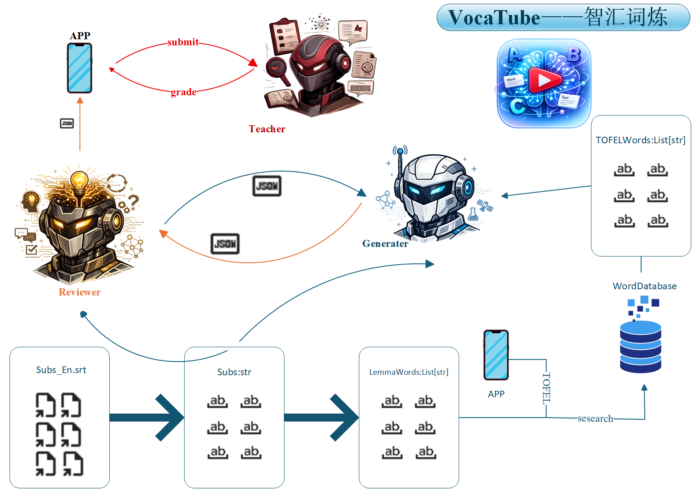

<div align="center">

</div>

## VocaTube

VocaTube is a vocabulary and video-learning app: a FastAPI backend serves word
lookups, downloaded YouTube videos with bilingual (Chinese/English) subtitles,
an English-test-prep RAG assistant, a QS-top-150 school search agent, and an
LLM-powered quiz generator. A Jetpack Compose Android app consumes the API.

The backend does not download or process YouTube videos itself — that
pipeline lives outside this repo. Videos and subtitles are expected to
already exist on disk and be referenced by the database.

## Features

- **Dictionary** — word/phrase/sentence lookups with translations, and
  category tagging (CET4, CET6, IELTS, SAT, TOEFL, kaoyan).
- **Video learning** — browse downloaded YouTube videos with synced Chinese
  and English subtitles.
- **Ask (RAG assistant)** — question answering grounded in curated
  CET4/CET6/IELTS/SAT/TOEFL/kaoyan prep notes, via a Chroma vector store and
  DeepSeek.
- **School search** — a LangChain agent (DeepSeek + Tavily) restricted to the
  official domains of QS top-150 universities, with search history.
- **Multi-Agent Based Quiz** — turns a video's subtitles into a **cloze fill-in-the-blank**
  and **reading-comprehension quiz** targeting a chosen vocabulary category, with
  automatic grading and wrong-answer explanations.

## Architecture

### Backend (`backend/app/`, FastAPI)

Two logically separate MySQL databases, each with its own SQLAlchemy
engine/session:

- **wordbase** — vocabulary (`words`, `translations`, `categories`,
  `word_categories`) plus school-search data (`schools`,
  `school_search_history`). See [`wordbase.md`](wordbase.md) for schema.
- **videobase** — video metadata (`videos`: title + relative paths to the
  video file and its Chinese/English subtitle files). See
  [`videobase.md`](videobase.md) for schema.

Neither database is populated by code in this repo. Video/subtitle files
referenced by `videobase` are expected to exist under `/opt/assets/...` on
the host and are served as static files under `/assets`.

Key modules:

- `main.py` — FastAPI app and all route handlers.
- `database.py` — DB engines/sessions/settings (via `pydantic_settings`).
- `models.py` — SQLAlchemy models for both databases.
- `RAG.py` — ingestion and querying for the test-prep assistant (`/ask`).
- `school_searcher.py` / `QS.py` — the QS-150 school search agent.
- `quiz_agent.py` / `quiz_prompts.py` / `quiz_schemas.py` — the LangGraph
  quiz-generation pipeline.
- `utils/parse.py`, `utils/lemma.py` — SRT parsing and spaCy lemmatization
  used by the quiz agent.

### API endpoints

| Method | Path | Purpose |
|---|---|---|
| GET | `/words/{word}` | Word detail lookup |
| GET | `/words/{word}/category/{category_code}` | Check if a word belongs to a category |
| GET | `/videos` | List videos |
| GET | `/videos/{video_id}` | Video detail (asset URLs for video + subtitles) |
| POST | `/ask` | Ask the RAG test-prep assistant |
| GET | `/schools` | List QS top-150 schools |
| POST | `/school/search` | Run the school-search agent |
| GET | `/school/history` | Past school-search queries |
| POST | `/quiz/generate` | Generate a quiz from a video's subtitles |
| POST | `/quiz/grade` | Grade quiz answers |

### Frontend (`frontend/`, Jetpack Compose Android app)

MVVM structure under `ui/<feature>/{FeatureScreen,FeatureViewModel}.kt`, with
four bottom-nav sections: Dictionary, VideoLearn, Wordbook, and Consult.
`data/remote/` holds the Retrofit API layer; `data/local/` handles on-device
persistence. The app talks to the backend over plain HTTP with no
authentication, intended for local development via `adb reverse`.

## Setup

### Backend

Requires Python >= 3.12.

```bash
cd backend
pip install -r requirements.txt
```

Create `backend/.env` with:

```
DB_HOST=...
DB_PORT=...
DB_USER=...
DB_PASSWORD=...
DB_NAME_MAIN=...   # wordbase
DB_NAME_LOG=...    # videobase
TAVILY_API_KEY=...
DEEPSEEK_API_KEY=...
ZHIPU_URL=...
ZHIPU_API_KEY=...
```

Build the RAG vector store once before `/ask` will work (otherwise it
returns a 503):

```bash
cd backend/app
python RAG.py ingest
```

Run the API server:

```bash
cd backend/app
uvicorn main:app --host 0.0.0.0 --port 8000
```

You can also query the RAG assistant or the school-search agent directly
from the command line, bypassing the API:

```bash
cd backend/app
python RAG.py ask "问题..."      # or `python RAG.py` for an interactive REPL
python school_searcher.py
```

### Frontend

Open `frontend/` in Android Studio, or build from the command line:

```bash
cd frontend
./gradlew assembleDebug
```

When testing against a locally-running backend over USB, forward the port
(the app's `Network.BASE_URL` is hardcoded to `http://127.0.0.1:8000/`):

```bash
adb reverse tcp:8000 tcp:8000
```

## Notes

- There is no test suite or lint config in this repo.
- `plan_frontend.md` documents the intended design for the VideoLearn quiz UI
  integration.
- Generated quizzes are held in an in-memory store with a 1-hour TTL and do
  not survive server restarts.
